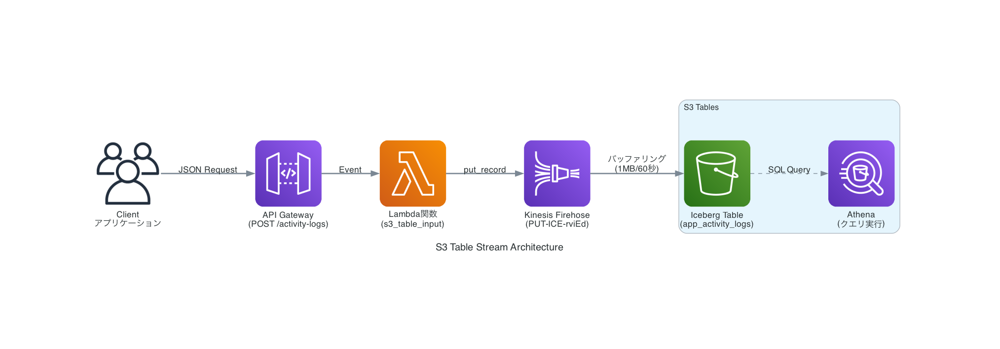

# S3 Table Stream Stack

## 概要

このプロジェクトは、API Gateway 経由でアクティビティログを受信し、Kinesis Firehose を通じて S3 Tables（Iceberg テーブル）にリアルタイムでデータを格納するサーバーレスシステムです。

## アーキテクチャ



### システム構成

- **API Gateway**: HTTPS エンドポイントで JSON リクエストを受信
- **Lambda 関数**: リクエストデータを処理して Firehose に送信
- **Kinesis Firehose**: データをバッファリングして S3 Tables に配信
- **S3 Tables**: Iceberg フォーマットでデータを永続化

## セットアップ

### 前提条件

- AWS CLI 設定済み
- AWS SAM CLI インストール済み
- Python 3.13
- **重要**: S3 Tables と Kinesis Firehose は事前に作成されている必要があります（このテンプレートには含まれていません）

### デプロイ手順

1. **リポジトリをクローン**

   ```bash
   git clone <repository-url>
   cd s3-table-stream-stack
   ```

2. **SAM 設定ファイルを編集**

   ```toml
   # samconfig.toml
   parameter_overrides = [
       "FirehoseDeliveryStreamName=your-firehose-stream-name"
   ]
   ```

3. **ビルド実行**

   ```bash
   sam build
   ```

4. **デプロイ実行**
   ```bash
   sam deploy
   ```

## 使用方法

### API エンドポイント

デプロイ後に出力される API Gateway URL に対して POST リクエストを送信します。

```bash
curl -X POST https://your-api-id.execute-api.ap-northeast-1.amazonaws.com/Prod/activity-logs \
  -H "Content-Type: application/json" \
  -d '{
    "activity_id": "act_20250725_001",
    "user_id": "user_12345",
    "action_name": "user_login",
    "entity_type": "authentication",
    "entity_id": "auth_session_789",
    "success": true,
    "response_time_ms": 245,
    "metadata": {
      "ip_address": "192.168.1.100",
      "user_agent": "Mozilla/5.0",
      "device": "desktop"
    }
  }'
```

### リクエストパラメータ

| パラメータ       | 型      | 必須       | 説明                                           |
| ---------------- | ------- | ---------- | ---------------------------------------------- |
| activity_id      | string  | オプション | アクティビティ ID（未指定時は自動生成）        |
| user_id          | string  | オプション | ユーザー ID（デフォルト: "unknown"）           |
| action_name      | string  | オプション | アクション名（デフォルト: "lambda_execution"） |
| entity_type      | string  | オプション | エンティティタイプ（デフォルト: "system"）     |
| entity_id        | string  | オプション | エンティティ ID（デフォルト: "lambda"）        |
| success          | boolean | オプション | 成功フラグ（デフォルト: true）                 |
| response_time_ms | integer | オプション | レスポンス時間（ミリ秒、デフォルト: 0）        |
| metadata         | object  | オプション | メタデータ（JSON オブジェクト）                |

### レスポンス

成功時:

```json
{
  "message": "ログデータが正常にFirehoseに送信されました",
  "record_id": "firehose-record-id"
}
```

エラー時:

```json
{
  "error": "エラーメッセージ"
}
```

## データの確認

### Athena クエリ

S3 Tables のデータは Athena で確認できます：

```sql
SELECT * FROM "my_s3_namespace"."app_activity_logs"
ORDER BY created_at DESC
LIMIT 10;
```

### テーブルスキーマ

```sql
CREATE TABLE `my_s3_namespace`.app_activity_logs (
    activity_id string,
    created_at timestamp,
    user_id string,
    action_name string,
    entity_type string,
    entity_id string,
    success boolean,
    response_time_ms int,
    metadata string
)
PARTITIONED BY (day(created_at))
TBLPROPERTIES ('table_type' = 'iceberg');
```

## 設定

### 環境変数

Lambda 関数では以下の環境変数が使用されます：

- `FIREHOSE_DELIVERY_STREAM_NAME`: Firehose 配信ストリーム名

### Firehose 設定

- **バッファサイズ**: 1MB
- **バッファ時間**: 60 秒
- **送信先**: S3 Tables (Iceberg)

## ファイル構成

```
s3-table-stream-stack/
├── template.yaml                 # SAM テンプレート
├── samconfig.toml               # SAM 設定ファイル
├── LambdaFunctionFunctions3tableinput/
│   └── lambda_function.py       # Lambda関数コード
├── request_sample.json          # リクエストサンプル
├── .gitignore                   # Git除外設定
└── README.md                    # このファイル
```

## トラブルシューティング

### よくある問題

1. **IAM 権限エラー**

   - Lambda 実行ロールに Firehose 権限が付与されているか確認
   - `firehose:PutRecord` 権限が必要

2. **データが表示されない**

   - Firehose のバッファ時間（最大 60 秒）を待つ
   - CloudWatch Logs でエラーを確認

3. **JSON 解析エラー**
   - リクエストボディが正しい JSON 形式か確認
   - Content-Type: application/json ヘッダーが設定されているか確認

### ログ確認

```bash
# Lambda関数のログ
aws logs tail /aws/lambda/s3_table_input --follow

# Firehoseのログ
aws logs tail /aws/kinesisfirehose/PUT-ICE-rviEd --follow
```

## 開発

### ローカルテスト

```bash
# SAM ローカル実行
sam local start-api

# テストリクエスト送信
curl -X POST http://localhost:3000/activity-logs \
  -H "Content-Type: application/json" \
  -d @request_sample.json
```

### デバッグ

Lambda 関数のログに event データが出力されます：

- 受信した event 構造
- 解析された body データ
- 送信データの詳細

## ライセンス

MIT License

## 作成者

Claude Code Generated Project
